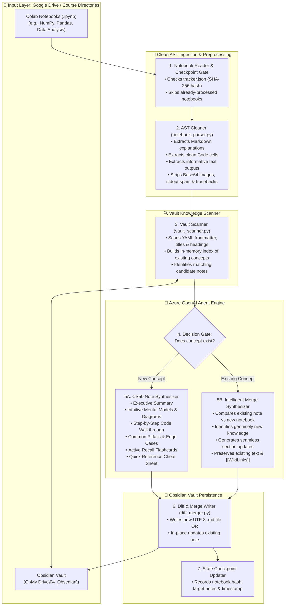

# 🧠 Colab-to-Obsidian AI Knowledge Agent — Architectural Blueprint & Plan

> **Project Root**: `D:\01_Ex_Files_Intermediate_SQL_for_Data_Scientists\V_Colab-to-Obsidian Notes`  
> **Source Material**: Google Colab / Jupyter Notebooks (`.ipynb`) in Local Drive / Course Directories  
> **Target Vault**: Obsidian Knowledge Base at `G:\My Drive\04_Obsedian\`  
> **Model Provider**: Azure OpenAI (Dedicated Model Deployment)  
> **Pedagogy Standard**: Harvard CS50 Instructional Methodology (Concept Before Syntax, Intuitive Mental Models, Active Recall)

---

## 🎯 1. Executive Summary & Vision

The objective of this project is to build an autonomous, quota-resilient AI agent that ingests **Jupyter / Google Colab notebooks (`.ipynb`)** and converts what you learned into **high-quality, permanent Obsidian study notes**.

Rather than dumping raw notebook transcripts, the agent acts as an **educational curriculum designer**:
- Extracts underlying **learning concepts**, distinguishing instruction from ephemeral debugging code.
- Checks your **existing Obsidian Vault** to determine whether the concept already exists.
- Performs an **Intelligent In-Place Merge** (expanding existing notes with new insights without destroying your existing text/`[[WikiLinks]]`) OR generates a **Brand-New Note**.
- Strictly adheres to **CS50 educational pedagogy**: intuition before syntax, progressive examples, line-by-line breakdowns, common mistakes, interactive flashcards, and cheat sheets.
- Maintains a **stateful checkpoint tracker (`tracker.json`)** to support single notebook runs, batch processing, resuming after interruptions, and zero redundant token usage.

---

## 🏗️ 2. End-to-End System Architecture



---

## 🔬 3. Notebook Deep-Dive Analysis (From Sample Inspection)

Inspection of sample notebooks (`section01_NumPy.ipynb` & `section01_NumPy_solutions.ipynb`) revealed three distinct types of content:

| Notebook Cell Type | What It Contains | How the Agent Must Treat It |
| :--- | :--- | :--- |
| **Markdown Cells** | Assignment prompts, theoretical notes, topic headers | **Primary Conceptual Signal**: Extracted to understand the *why* and the topic scope. |
| **Code Cells** | Imports, array generation (`arange`, `linspace`), slicing, boolean masks, `np.where` | **Pedagogical Evidence**: Reformatted with line-by-line commentary, contrasting standard Python lists vs. NumPy vectorization. |
| **Output Cells** | Array outputs, summary statistics (`mean`, `median`), shapes | **Verification**: Retained only when it demonstrates a key concept (e.g. broadcasting results); verbose arrays are summarized. |
| **Noise / Ephemeral** | Pip installs, redundant prints, empty cells, base64 image strings | **Purged Completely**: Stripped in preprocessing before calling Azure OpenAI to save 80%+ token quota. |

---

## 🏛️ 4. Note Pedagogy & Structural Standard (CS50 Style)

Every note generated or updated must conform to this educational standard:

```markdown
---
title: "NumPy Vectorization & Multi-Dimensional Slicing"
source: "Google Colab | section01_NumPy_solutions.ipynb"
topic: "Python | Data Analysis & Scientific Computing"
difficulty: "Beginner to Intermediate"
created: "2026-09-27"
tags:
  - python
  - numpy
  - data-analysis
  - vectorization
---

# NumPy Vectorization & Multi-Dimensional Slicing

> [!ABSTRACT] Executive Summary
> Build intuition for why NumPy arrays outperform Python lists, how memory contiguous buffers enable SIMD vectorization, and how multi-axis slicing works.

## 1. Building Intuition: Python Lists vs. NumPy Arrays
*Detailed mental model explaining pointers vs contiguous memory buffers with ASCII or Mermaid diagram.*

## 2. Core Concepts & Progression
- **Array Attributes**: `.ndim`, `.shape`, `.size`, `.dtype`
- **Generators**: `np.arange()` vs `np.linspace()` vs `default_rng()`

## 3. Concrete Code Walkthrough with Line-by-Line Breakdown
```python
# Create 5x2 array of multiples of 10
my_array = np.arange(10, 101, 10).reshape(5, 2)
```
- Line 1: `np.arange(10, 101, 10)` generates a 1D sequence from 10 to 100 with step 10.
- Line 2: `.reshape(5, 2)` changes dimensions without copying underlying memory.

## 4. Common Misconceptions & Pitfalls
> [!WARNING] Watch Out: Copies vs Views
> Slicing a NumPy array creates a **view**, not a copy. Mutating `sub_array = arr[:2]` modifies `arr`!

## 5. Active Recall & Self-Assessment
> [!question]- When should you choose np.linspace over np.arange?
> > [!success]- Answer
> > Use `np.linspace(start, stop, num)` when you know the exact count of samples required; use `np.arange(start, stop, step)` when you care about the step increment.

## 6. Quick Reference Cheat Sheet
| Syntax | Purpose | Example |
| :--- | :--- | :--- |
| `arr[row, col]` | 2D element lookup | `arr[2, 1]` |
| `arr[mask]` | Boolean filtering | `arr[arr > 50]` |
| `np.where(c, x, y)` | Conditional ternary | `np.where(arr > 0, 1, -1)` |
```

---

## 🗂️ 5. Project Directory Structure

```text
V_Colab-to-Obsidian Notes/
├── PLAN.md                     # This master architectural blueprint
├── main.py                     # CLI Entry point: batch processor & single notebook runner
├── requirements.txt            # openai, python-dotenv, nbformat
├── .env.example                # Azure OpenAI configuration template
├── .env                        # Local Azure OpenAI deployment secrets (git-ignored)
├── tracker.json                # State machine: records notebook hashes & output mappings
│
├── core/
│   ├── __init__.py             # Package marker
│   ├── notebook_parser.py      # Cleans .ipynb AST, strips noise/base64, outputs clean JSON
│   ├── vault_scanner.py        # Indexes G:\My Drive\04_Obsedian, checks existing notes/links
│   ├── ai_synthesizer.py       # Calls Azure OpenAI with CS50 pedagogical prompts & quota pacing
│   ├── diff_merger.py          # Performs intelligent in-place section merging on existing notes
│   └── tracker.py              # Manages tracker.json checkpoints, retries, and resume logic
│
└── tests/
    ├── test_parser.py          # Validates AST cleaning on section01_NumPy.ipynb
    └── test_merge.py           # Validates non-destructive note updating
```

---

## 🚦 6. Implementation Roadmap

### Milestone 1: Foundation & AST Notebook Cleaner
- Initialize virtual environment & install `openai`, `python-dotenv`, `nbformat`.
- Build `notebook_parser.py` to parse any `.ipynb` file into clean JSON (Markdown concepts, clean code, concise outputs).
- Test parser on `section01_NumPy.ipynb` to verify zero image bloat.

### Milestone 2: Vault Scanner & Knowledge Matching
- Build `vault_scanner.py` to index notes in `G:\My Drive\04_Obsedian\`.
- Implement heuristic & keyword matching against frontmatter YAML and headings (`[[NumPy]]`, `[[Pandas]]`).

### Milestone 3: CS50 Pedagogical Synthesis Engine
- Configure Azure OpenAI client in `ai_synthesizer.py` with TPM quota protection and exponential backoff retry.
- Construct the master CS50 system prompt (intuition, line-by-line breakdowns, active recall, cheat sheet).

### Milestone 4: Intelligent In-Place Merger
- Build `diff_merger.py` to either create a new `.md` file in the proper subfolder (e.g. `02_Python/02_Data Analysis (Pandas)/`) OR update existing notes by appending/updating target sections without losing user edits.

### Milestone 5: Stateful Checkpointer & CLI Runner
- Implement `tracker.json` to record processed notebook hashes and execution timestamps.
- Build `main.py` CLI supporting:
  - `python main.py --file "path/to/notebook.ipynb"` (Single notebook test)
  - `python main.py --batch "path/to/folder"` (Incremental batch processing)

---

## 💡 Confirmed Architecture Decisions

| Decision Area | User Choice | Rationale |
| :--- | :--- | :--- |
| **Storage Access** | Local Drive Mirror (`G:\My Drive\`) | Direct filesystem I/O without cloud OAuth or REST latency. |
| **Update Mode** | Intelligent In-Place Merge | Enhances existing notes with new insights while preserving formatting and `[[WikiLinks]]`. |
| **Execution Trigger** | On-Demand CLI | Predictable, user-controlled processing with immediate feedback. |
| **Platform** | Pure Python + Azure OpenAI SDK | Clean, flexible AST parsing, zero cloud UI limitations, and dedicated deployment quota. |
