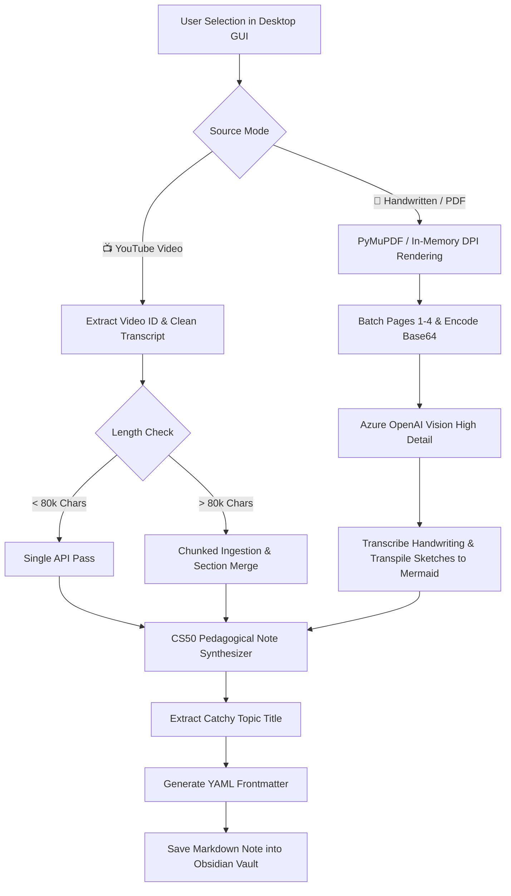
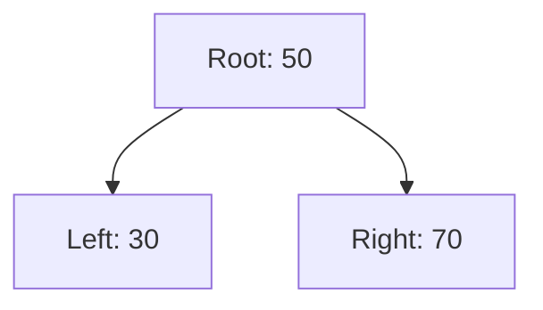

# 🎬📝 Obsidian Notes Generator (YouTube & Handwritten Documents)

A modern desktop application that converts **YouTube Videos** and **Handwritten Notes / Technical Documents (PDF & Images)** into beautifully structured, CS50-pedagogy Obsidian study notes using Azure OpenAI.

---

## ✨ Features

### 1. 📺 YouTube Video Mode
- **Instant Transcript Ingestion** — Automatically extracts English and auto-generated transcripts using `youtube-transcript-api`.
- **Smart Chunking** — Automatically splits long transcripts (>80k characters) at sentence boundaries and merges synthesized sections seamlessly.
- **Fast Text Synthesis** — Optimized for high-speed, cost-effective processing using models like `gpt-5-mini`.

### 2. 📝 Handwritten Notes & Document Mode
- **Multimodal Vision Analysis** — Understands cursive handwriting, math symbols, margin annotations, circled highlights, and rough sketches.
- **Supported File Types** — `.pdf`, `.png`, `.jpg`, `.jpeg`.
- **Hand-Drawn Sketches → Mermaid.js** — Automatically converts hand-drawn flowcharts, architecture diagrams, mind maps, and entity relationships into executable `mermaid` code blocks rendered directly inside Obsidian.
- **High-DPI In-Memory Rendering** — Utilizes PyMuPDF (`fitz`) to render PDF pages at 2.0x zoom (~150 DPI) directly in memory without cluttering your vault with temporary image files.
- **Multi-Page Batching** — Automatically batches multi-page documents (up to 4 pages per vision call) and synthesizes them into a single cohesive study guide.

### 3. 🧠 Obsidian Knowledge Graph & CS50 Pedagogical Structure
- **Obsidian `[[WikiLinks]]`** — Every core concept, tool, and entity is cross-linked for seamless Knowledge Graph navigation.
- **Native Obsidian Callouts** — Margin notes, tips, warnings, and executive summaries use rich Obsidian callout syntax (`> [!NOTE]`, `> [!WARNING]`, `> [!TIP]`, `> [!IMPORTANT]`, `> [!ABSTRACT]`).
- **Collapsible Active Recall** — Interactive flashcard-style questions (`> [!question]-`) with folded answers (`> [!success]- Answer`) for active recall studying.
- **Quick Reference Cheat Sheet** — Scannable syntax tables, commands, and rules at the end of every note.
- **Unified YAML Frontmatter** — Tracks source type, original filename/URL, creation date, difficulty, topic, skills, and tags.

### 4. 🎨 Modern Dark-Mode Desktop GUI
- Built with **CustomTkinter** for a sleek, responsive dark interface.
- **Mode Switcher** — Segmented control `[ 📺 YouTube Video | 📝 Handwritten Notes / PDF ]` smoothly swaps between URL input and document file browsing.
- **Folder Memory** — Remembers your last-selected Obsidian vault folder across restarts.
- **Live Progress & Thread Safety** — Non-blocking background worker threads with step-by-step status messages and error dialogs.

---

## 🏗️ Architecture & Pipeline



---

## 🚀 Quick Start

### 1. Environment Setup

Clone or open the repository in a terminal:

```powershell
# Create virtual environment
python -m venv .venv

# Activate virtual environment (Windows PowerShell)
.venv\Scripts\activate

# Install dependencies
pip install -r requirements.txt
```

### 2. Configure Environment (`.env`)

Create or update `.env` in the project root:

```env
# Azure OpenAI Service Credentials
AZURE_OPENAI_ENDPOINT=https://your-resource.openai.azure.com/
AZURE_OPENAI_KEY=your-api-key
AZURE_OPENAI_DEPLOYMENT=gpt-5-mini
AZURE_OPENAI_API_VERSION=2024-10-21

# Optional: Dedicated Vision Deployment (defaults to AZURE_OPENAI_DEPLOYMENT if omitted)
# AZURE_OPENAI_VISION_DEPLOYMENT=gpt-4o
# AZURE_OPENAI_VISION_API_VERSION=2024-12-01-preview
```

> [!TIP]
> Both `gpt-5-mini` and `gpt-4o` support vision. If you have a single deployment (e.g. `gpt-5-mini` or `gpt-4o`), simply set `AZURE_OPENAI_DEPLOYMENT` and the app handles both text and multimodal documents seamlessly!

### 3. Run the Application

```powershell
python main.py
```

---

## 📖 How to Use

### Generating Notes from a YouTube Video:
1. Ensure the segmented toggle is on **📺 YouTube Video**.
2. Paste the YouTube video URL (e.g., `https://www.youtube.com/watch?v=...`).
3. Click **Browse...** to select your target Obsidian folder (saved automatically for future sessions).
4. Click **🚀 Create Notes** and monitor real-time progress.

### Generating Notes from Handwritten Notes or Documents:
1. Click the **📝 Handwritten Notes / PDF** segmented button.
2. Click **Browse Document...** and select any `.pdf`, `.png`, `.jpg`, or `.jpeg` file.
   - The file size and page count will be displayed on the badge.
3. Select your target Obsidian vault folder.
4. Click **🚀 Create Notes**. The app renders pages, analyzes handwriting/diagrams, and outputs structured Obsidian notes.

---

## 📝 Generated Note Structure

Every generated `.md` note strictly follows this standard:

```markdown
---
source: "Handwritten Document" # or "YouTube"
source_file: "my_lecture_notes.pdf"
pages_processed: 3
created: "2026-09-26"
topic: "Computer Science | Data Structures"
difficulty: "Intermediate"
skills:
  - "Tree Traversals"
  - "Graph Theory"
tags:
  - "handwritten-notes"
  - "data-structures"
---

# Binary Search Trees and Graph Traversals

> [!ABSTRACT] Executive Summary
> Comprehensive notes synthesized from lecture diagrams and notes on tree structures...

## 1. Core Principles & Theoretical Foundation
Detailed explanation using [[WikiLinks]] for concepts like [[Binary Search Tree]], [[Root Node]], and [[Depth First Search]]...

## 2. Visual Architecture & Diagrams


> [!NOTE]
> Margin Note from Page 1: Remember that in-order traversal of a BST always yields sorted keys!

## 3. Concrete Implementation
```python
class TreeNode:
    def __init__(self, val=0, left=None, right=None):
        self.val = val
        self.left = left
        self.right = right
```

## 4. Active Recall & Self-Assessment
> [!question]- What is the worst-case time complexity of an unbalanced BST search?
> > [!success]- Answer
> > $O(N)$ when the tree degrades into a linked list. Use balanced variants like [[AVL Trees]] or [[Red-Black Trees]] for $O(\log N)$.

## 5. Quick Reference Cheat Sheet
| Operation | Average Case | Worst Case |
| :--- | :--- | :--- |
| Search | $O(\log N)$ | $O(N)$ |
| Insert | $O(\log N)$ | $O(N)$ |
```

---

## 📁 Project Directory Structure

```
Video_to_Notes_Generator/
├── main.py                  # Application entry point & environment validator
├── .env                     # Azure OpenAI API credentials (git-ignored)
├── config.json              # User preferences & last-used folder (git-ignored)
├── requirements.txt         # Project dependencies
├── core/
│   ├── transcript.py        # YouTube transcript extraction & cleaning
│   ├── image_processor.py   # PDF rendering (PyMuPDF) & image base64 encoding
│   ├── ai_client.py         # Azure OpenAI client (chunking + multimodal vision)
│   ├── notes_generator.py   # Prompts (YouTube + Handwritten/Diagram CS50 formats)
│   └── file_manager.py      # Obsidian note writer, YAML frontmatter & persistence
└── gui/
    └── app.py               # CustomTkinter dual-mode dark GUI
```

---

## 🛠️ Dependencies

- **customtkinter** (>= 5.2.0) — Modern desktop user interface
- **openai** (>= 1.50.0) — Azure OpenAI API client
- **python-dotenv** (>= 1.0.0) — Environment variable management
- **youtube-transcript-api** (>= 0.6.2) — Video subtitle and transcript retrieval
- **pymupdf** (>= 1.23.0) — High-performance PDF rendering and page extraction (no external binaries needed)
