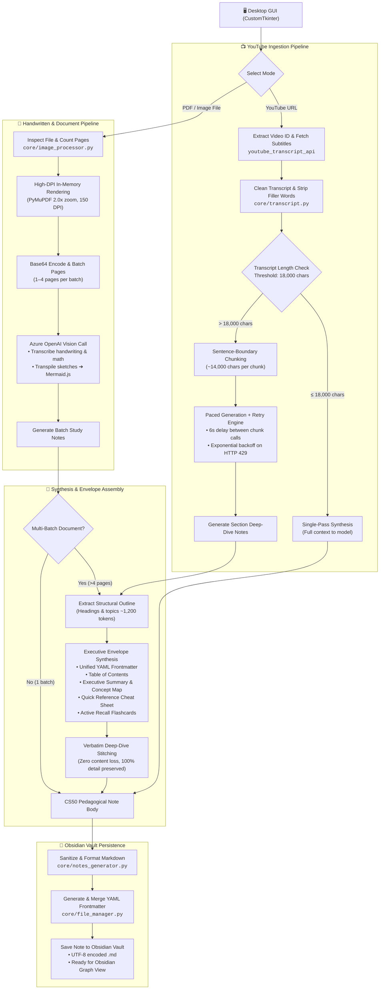
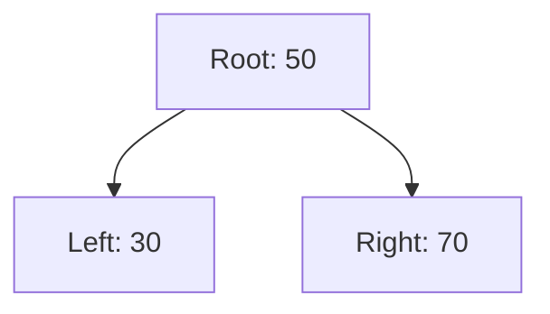

# 🎬📝 Obsidian Notes Generator (YouTube & Handwritten Documents)

A modern desktop application that converts **YouTube Videos** and **Handwritten Notes / Technical Documents (PDF & Images)** into beautifully structured, CS50-pedagogy Obsidian study notes using Azure OpenAI.

---

## ✨ Features

### 1. 📺 YouTube Video Mode
- **Instant Transcript Ingestion** — Automatically extracts English and auto-generated transcripts using `youtube-transcript-api`.
- **Quota-Aware Smart Chunking** — Splits long transcripts (>18k characters) at natural sentence boundaries, protecting against Azure OpenAI TPM rate limits while preserving full context.
- **Envelope Document Assembly** — Synthesizes chunked notes into a unified study guide using an outline-based executive envelope with 100% content preservation.
- **Fast Text Synthesis** — Optimized for high-speed, cost-effective processing using models like `gpt-5-mini`.

### 2. 📝 Handwritten Notes & Document Mode
- **Multimodal Vision Analysis** — Understands cursive handwriting, math symbols, margin annotations, circled highlights, and rough sketches.
- **Supported File Types** — `.pdf`, `.png`, `.jpg`, `.jpeg`.
- **Hand-Drawn Sketches → Mermaid.js** — Automatically converts hand-drawn flowcharts, architecture diagrams, mind maps, and entity relationships into executable `mermaid` code blocks rendered directly inside Obsidian.
- **High-DPI In-Memory Rendering** — Utilizes PyMuPDF (`fitz`) to render PDF pages at 2.0x zoom (~150 DPI) directly in memory without cluttering your vault with temporary image files.
- **Multi-Page Batching** — Automatically batches multi-page documents (up to 4 pages per vision call) and synthesizes them into a single cohesive study guide.

### 3. 🧠 Obsidian Knowledge Graph & CS50 Pedagogical Structure
- **Obsidian `[[WikiLinks]]`** — Every core concept, tool, and entity is cross-linked for seamless Knowledge Graph navigation.
- **Native Obsidian Callouts** — Margin notes, tips, warnings, and executive summaries use rich Obsidian callout syntax (`> [!NOTE]`, `> [!WARNING]`, `> [!TIP]`, `> [!IMPORTANT]`, `> [!ABSTRACT]`).
- **Collapsible Active Recall** — Interactive flashcard-style questions (`> [!question]-`) with folded answers (`> [!success]- Answer`) for active recall studying.
- **Quick Reference Cheat Sheet** — Scannable syntax tables, commands, and rules at the end of every note.
- **Unified YAML Frontmatter** — Tracks source type, original filename/URL, creation date, difficulty, topic, skills, and tags.

### 4. 🎨 Modern Dark-Mode Desktop GUI
- Built with **CustomTkinter** for a sleek, responsive dark interface.
- **Mode Switcher** — Segmented control `[ 📺 YouTube Video | 📝 Handwritten Notes / PDF ]` smoothly swaps between URL input and document file browsing.
- **Folder Memory** — Remembers your last-selected Obsidian vault folder across restarts.
- **Live Progress & Thread Safety** — Non-blocking background worker threads with step-by-step status messages and error dialogs.

---

## 🏗️ Architecture & Pipeline

The application employs a resilient, multi-stage processing pipeline built specifically for Azure OpenAI environments with strict Token Per Minute (TPM) limits (e.g., 10,000 TPM quota). It seamlessly handles single-pass inputs, multi-hour YouTube transcripts, and multi-page handwritten PDF documents.



### Key Architectural Highlights

1. **Envelope Document Assembly Architecture**: Rather than using naive recursive merges that consume massive token budgets and trigger `429: rate_limit_exceeded` errors, long documents are assembled via an "Executive Envelope". Individual chunks generate rich deep-dive notes independently. An ultra-compact structural outline (~1,200 tokens) is extracted across all chunks, and a single lightweight synthesis call generates the executive summary, concept map, cheat sheet, and active recall questions. The deep-dive sections are then stitched into the body verbatim, preserving 100% of the content while staying well within TPM rate limits.
2. **Rate Limit & Quota Resilience**: Built-in 6-second pacing delays between API chunk requests allow token buckets to replenish, and automated exponential backoff handles transient HTTP 429 errors with dynamic `Retry-After` header parsing.
3. **High-DPI In-Memory Vision**: PDF documents are rasterized using PyMuPDF directly in RAM as PNG buffers at 2.0x zoom (150 DPI), ensuring crystal-clear handwriting and math symbol recognition with zero disk footprint.
4. **Sketch-to-Mermaid Transpilation**: Hand-drawn charts, arrows, and workflows are recognized by the vision prompt and automatically converted into executable Mermaid.js diagrams rendered natively by Obsidian.

---

## 🚀 Quick Start

### 1. Environment Setup

Clone or open the repository in a terminal:

```powershell
# Create virtual environment
python -m venv .venv

# Activate virtual environment (Windows PowerShell)
.venv\Scripts\activate

# Install dependencies
pip install -r requirements.txt
```

### 2. Configure Environment (`.env`)

Create or update `.env` in the project root:

```env
# Azure OpenAI Service Credentials
AZURE_OPENAI_ENDPOINT=https://your-resource.openai.azure.com/
AZURE_OPENAI_KEY=your-api-key
AZURE_OPENAI_DEPLOYMENT=gpt-5-mini
AZURE_OPENAI_API_VERSION=2024-10-21

# Optional: Dedicated Vision Deployment (defaults to AZURE_OPENAI_DEPLOYMENT if omitted)
# AZURE_OPENAI_VISION_DEPLOYMENT=gpt-4o
# AZURE_OPENAI_VISION_API_VERSION=2024-12-01-preview
```

> [!TIP]
> Both `gpt-5-mini` and `gpt-4o` support vision. If you have a single deployment (e.g. `gpt-5-mini` or `gpt-4o`), simply set `AZURE_OPENAI_DEPLOYMENT` and the app handles both text and multimodal documents seamlessly!

### 3. Run the Application

```powershell
python main.py
```

---

## 📖 How to Use

### Generating Notes from a YouTube Video:
1. Ensure the segmented toggle is on **📺 YouTube Video**.
2. Paste the YouTube video URL (e.g., `https://www.youtube.com/watch?v=...`).
3. Click **Browse...** to select your target Obsidian folder (saved automatically for future sessions).
4. Click **🚀 Create Notes** and monitor real-time progress.

### Generating Notes from Handwritten Notes or Documents:
1. Click the **📝 Handwritten Notes / PDF** segmented button.
2. Click **Browse Document...** and select any `.pdf`, `.png`, `.jpg`, or `.jpeg` file.
   - The file size and page count will be displayed on the badge.
3. Select your target Obsidian vault folder.
4. Click **🚀 Create Notes**. The app renders pages, analyzes handwriting/diagrams, and outputs structured Obsidian notes.

---

## 📝 Generated Note Structure

Every generated `.md` note strictly follows this standard:

```markdown
---
source: "Handwritten Document" # or "YouTube"
source_file: "my_lecture_notes.pdf"
pages_processed: 3
created: "2026-09-26"
topic: "Computer Science | Data Structures"
difficulty: "Intermediate"
skills:
  - "Tree Traversals"
  - "Graph Theory"
tags:
  - "handwritten-notes"
  - "data-structures"
---

# Binary Search Trees and Graph Traversals

> [!ABSTRACT] Executive Summary
> Comprehensive notes synthesized from lecture diagrams and notes on tree structures...

## 1. Core Principles & Theoretical Foundation
Detailed explanation using [[WikiLinks]] for concepts like [[Binary Search Tree]], [[Root Node]], and [[Depth First Search]]...

## 2. Visual Architecture & Diagrams


> [!NOTE]
> Margin Note from Page 1: Remember that in-order traversal of a BST always yields sorted keys!

## 3. Concrete Implementation
```python
class TreeNode:
    def __init__(self, val=0, left=None, right=None):
        self.val = val
        self.left = left
        self.right = right
```

## 4. Active Recall & Self-Assessment
> [!question]- What is the worst-case time complexity of an unbalanced BST search?
> > [!success]- Answer
> > $O(N)$ when the tree degrades into a linked list. Use balanced variants like [[AVL Trees]] or [[Red-Black Trees]] for $O(\log N)$.

## 5. Quick Reference Cheat Sheet
| Operation | Average Case | Worst Case |
| :--- | :--- | :--- |
| Search | $O(\log N)$ | $O(N)$ |
| Insert | $O(\log N)$ | $O(N)$ |
```

---

## 📁 Project Directory Structure

```text
Video_to_Notes_Generator/
├── main.py                  # Application entry point; validates settings & launches GUI
├── requirements.txt         # Production dependencies with pinned minimum versions
├── .env.example             # Configuration template for Azure OpenAI credentials
├── .env                     # Local environment file containing API keys (git-ignored)
├── config.json              # Persistent user preferences, e.g. last vault path (git-ignored)
├── .gitignore               # Ignores secrets, caches, virtual environments, and test files
├── README.md                # Comprehensive documentation, setup guide, and architectural manual
├── core/                    # Backend engine for ingestion, vision, LLM, and file operations
│   ├── __init__.py          # Marks core as an importable Python package
│   ├── ai_client.py         # Azure OpenAI client, Envelope Document Assembly, and 429 retries
│   ├── file_manager.py      # Obsidian note persistence, YAML frontmatter creation & config I/O
│   ├── image_processor.py   # High-DPI PDF rasterization, image encoding & vision batching
│   ├── notes_generator.py   # CS50 pedagogical prompts, markdown sanitization & metadata parsing
│   └── transcript.py        # YouTube video URL parsing, transcript fetching & text cleaning
└── gui/                     # Modern desktop interface built with CustomTkinter
    ├── __init__.py          # Marks gui as an importable Python package
    └── app.py               # Dark-mode GUI, mode switcher, background worker threads & logging
```

---

### Detailed Folder & Module Breakdown

#### 1. Root Configuration & Entry Points

| File / Folder | Purpose & Functionality |
| :--- | :--- |
| **`main.py`** | **Application Bootstrapper**: Validates required Azure OpenAI configuration keys (`AZURE_OPENAI_ENDPOINT`, `AZURE_OPENAI_KEY`, etc.), displays native desktop error dialogs if credentials are missing, and initializes the `NotesApp` CustomTkinter event loop. |
| **`requirements.txt`** | **Dependency Manifest**: Specifies all required Python libraries with compatibility constraints (`customtkinter`, `openai`, `python-dotenv`, `youtube-transcript-api`, `pymupdf`). |
| **`.env.example`** | **Configuration Blueprint**: Documents all supported environment variables including Azure OpenAI credentials, optional dedicated vision deployments, API versions, `AZURE_OPENAI_REASONING_EFFORT`, and `AZURE_OPENAI_MAX_COMPLETION_TOKENS`. |
| **`.env`** | **Active Credentials**: Local configuration storing private API keys and endpoints (never committed to version control). Loaded at startup via `python-dotenv`. |
| **`config.json`** | **Stateful Cache**: Persists user preferences across sessions (specifically the last selected Obsidian vault directory) so you don't need to re-browse on each app launch. |
| **`.gitignore`** | **Repository Filter**: Prevents accidental tracking of private secrets (`.env`), Python caches (`__pycache__`), virtual environments (`.venv`), local user configs (`config.json`), and temporary markdown outputs. |

---

#### 2. `core/` — Processing & Intelligence Engine

The `core/` package encapsulates all business logic, ingestion pipelines, AI orchestration, and file operations. It is completely decoupled from the GUI layer.

| File | Purpose & Responsibilities |
| :--- | :--- |
| **`core/__init__.py`** | Marks the directory as an importable Python package, exposing clean package namespaces. |
| **`core/transcript.py`** | **YouTube Transcript Ingestion**: <br/>• Parses multiple YouTube URL formats (standard watch URLs, `youtu.be`, mobile links, `/embed/`, and `/shorts/`).<br/>• Uses `youtube-transcript-api` to retrieve manual or auto-generated subtitles with automatic multi-language fallback.<br/>• Strips timestamps and sound cues (`[Music]`, `[Applause]`), and normalizes whitespace into clean, coherent text. |
| **`core/image_processor.py`** | **Multimodal Ingestion & High-DPI Rendering**: <br/>• Inspects file types (`.pdf`, `.png`, `.jpg`, `.jpeg`) and calculates page counts.<br/>• Uses PyMuPDF (`fitz`) to rasterize vector PDF pages directly in memory into high-resolution PNG image buffers at 2.0x zoom (~150 DPI) without writing image files to disk.<br/>• Formats and encodes images into Base64 data URLs.<br/>• Groups multi-page documents into logical batches (up to 4 pages per batch) for multimodal vision processing. |
| **`core/ai_client.py`** | **Azure OpenAI Orchestration & Rate-Limit Resilience**: <br/>• Manages chat completions and multimodal vision calls with `AzureOpenAI`.<br/>• **Envelope Document Assembly**: Synthesizes long documents by extracting an outline (~1,200 tokens), generating an executive envelope (frontmatter, summary, concept map, cheat sheet, active recall), and stitching deep-dive content verbatim.<br/>• **TPM Rate-Limit Protection**: Enforces 18,000-char chunk thresholds, 6-second inter-chunk pacing delays, and exponential backoff retry (up to 6 attempts) on HTTP 429 status codes.<br/>• **Token Budgeting**: Dynamically manages `max_completion_tokens` (32,768) and `reasoning_effort` (`high`/`medium`/`low`) to avoid reasoning token truncation on models like `gpt-5-mini`. |
| **`core/notes_generator.py`** | **Prompt Engineering & CS50 Pedagogical Formatting**: <br/>• Defines the master system prompt enforcing CS50 pedagogical structure, Obsidian `[[WikiLinks]]`, native callouts (`[!NOTE]`, `[!WARNING]`, `[!TIP]`, `[!ABSTRACT]`), Mermaid.js diagrams, and collapsible active recall questions (`[!question]-` / `[!success]-`).<br/>• Cleans and sanitizes raw model output (removes outer code fence wrappers, normalizes headers).<br/>• Parses note text to extract catchy, descriptive titles and high-level categorization topics for frontmatter generation. |
| **`core/file_manager.py`** | **Obsidian Note Persistence & Configuration Manager**: <br/>• Sanitizes extracted titles into safe, cross-platform filenames (removing forbidden Windows/POSIX characters like `\ / : * ? " < > \|`).<br/>• Synthesizes and merges YAML frontmatter blocks with comprehensive metadata (source type, file name, creation date, difficulty, topic, skills, tags).<br/>• Writes note files to the target Obsidian vault directory with explicit UTF-8 encoding (supporting emojis, math symbols, and diagram notation).<br/>• Reads and persists runtime preferences to `config.json`. |

---

#### 3. `gui/` — Desktop User Interface

The `gui/` package provides a modern, responsive desktop interface built with CustomTkinter.

| File | Purpose & Responsibilities |
| :--- | :--- |
| **`gui/__init__.py`** | Marks the directory as an importable Python package, exporting `NotesApp`. |
| **`gui/app.py`** | **Desktop Application UI (`NotesApp`)**: <br/>• Implements a modern dark-mode interface with custom CTk styling.<br/>• **Segmented Mode Switcher**: Smoothly transitions between YouTube URL input and handwritten PDF/image file browsing.<br/>• **Thread-Safe Processing**: Executes note generation in background worker threads (`threading.Thread`) to keep the GUI responsive.<br/>• **Live Progress & Logging**: Provides step-by-step progress callbacks, animated status updates, and interactive completion dialogs.<br/>• **Vault Memory**: Automatically loads and saves the last-used Obsidian vault path to `config.json`. |

---

#### 4. Runtime & Vault Storage

- **Obsidian Vault Directory**: Notes generated by the application are written directly to your selected Obsidian vault folder (e.g., `g:\My Drive\04_Obsedian\YourVault\`). Generated notes are immediately indexable by Obsidian, automatically linking into your Knowledge Graph and rendering interactive callouts, Mermaid diagrams, and collapsible active recall questions.

---

## 🛠️ Dependencies

- **customtkinter** (>= 5.2.0) — Modern desktop user interface
- **openai** (>= 1.50.0) — Azure OpenAI API client
- **python-dotenv** (>= 1.0.0) — Environment variable management
- **youtube-transcript-api** (>= 0.6.2) — Video subtitle and transcript retrieval
- **pymupdf** (>= 1.23.0) — High-performance PDF rendering and page extraction (no external binaries needed)
